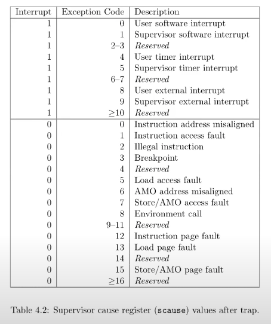

# cow

## Implement copy-on-write fork

首先在地址的标志位中添加COW标记位，表示该页表此时被多个进程共享。因为页表的第8，9位是保留未使用的，因此我们选择第8位作为COW标记位。

```c
#define PTE_U (1L << 4) // user can access
#define PTE_COW (1L << 8)  // cow标识位
```

首先我们查看一下地址空间，即
```text
// Physical memory layout

// qemu -machine virt is set up like this,
// based on qemu's hw/riscv/virt.c:
//
// 00001000 -- boot ROM, provided by qemu
// 02000000 -- CLINT
// 0C000000 -- PLIC
// 10000000 -- uart0 
// 10001000 -- virtio disk 
// 80000000 -- boot ROM jumps here in machine mode
//             -kernel loads the kernel here
// unused RAM after 80000000.

// the kernel uses physical memory thus:
// 80000000 -- entry.S, then kernel text and data
// end -- start of kernel page allocation area
// PHYSTOP -- end RAM used by the kernel
```

可以看出end到PHTSTOP时页表的地址范围，因此我们可以计算出页表的数量，用于后续对于页表的引用计数。

``#define NPAGES ((PHYSTOP - KERNBASE) / PGSIZE)``

然后在kalloc.c中实现页表的引用计数，这里使用一把锁管理freelist和count两个数据结构，是因为我在最初实现的时候使用两把锁发现会出现思索的的情况。

```c
struct {
  struct spinlock lock;
  struct run *freelist;
  char count[NPAGES];
} kmem;
```

然后初始化kmem变量，这里将count初始化为1和kfree函数搭配使用就会使得初始值初始化为0。

```c
//kalloc.c
void
kinit()
{
initlock(&kmem.lock, "kmem");
freerange(end, (void*)PHYSTOP);
}
void
freerange(void *pa_start, void *pa_end)
{
  char *p;
  p = (char*)PGROUNDUP((uint64)pa_start);
  for(; p + PGSIZE <= (char*)pa_end; p += PGSIZE){
    kmem.count[((uint64)p - KERNBASE) / PGSIZE] = 1;  
    kfree(p);
  }
}
```

然后需要实现两个函数，一个是增加给定地址的页表的计数，另一个是减小引用计数。

```c
void 
incr(uint64 pa)
{
  acquire(&kmem.lock);
  kmem.count[(pa - KERNBASE) / PGSIZE] += 1;
  release(&kmem.lock);
}

void 
desc(uint64 pa)
{
  acquire(&kmem.lock);
  kmem.count[(pa - KERNBASE) / PGSIZE] -= 1;
  release(&kmem.lock);
}
```

在释放页表时，首先减少该页表的引用计数，然后当且仅当引用计数为0时，说明没有进程引用该页表，此时释放。

在分配页表时，增加相应页表的引用计数。

```c
// Free the page of physical memory pointed at by pa,
// which normally should have been returned by a
// call to kalloc().  (The exception is when
// initializing the allocator; see kinit above.)
void
kfree(void *pa)
{
  struct run *r;

  if(((uint64)pa % PGSIZE) != 0 || (char*)pa < end || (uint64)pa >= PHYSTOP)
    panic("kfree");

  desc((uint64)pa);
  if (kmem.count[((uint64)pa - KERNBASE) / PGSIZE] == 0) {
    // Fill with junk to catch dangling refs.
    memset(pa, 1, PGSIZE);

    r = (struct run *)pa;

    acquire(&kmem.lock);
    r->next = kmem.freelist;
    kmem.freelist = r;
    release(&kmem.lock);
  }
}

// Allocate one 4096-byte page of physical memory.
// Returns a pointer that the kernel can use.
// Returns 0 if the memory cannot be allocated.
void *
kalloc(void)
{
  struct run *r;
  acquire(&kmem.lock);
  r = kmem.freelist;
  if(r)
    kmem.freelist = r->next;
  release(&kmem.lock);

  if(r){
    memset((char*)r, 5, PGSIZE); // fill with junk
    incr((uint64)r);
  }
  return (void *)r;
}

```

然后修改uvmcopy函数，在fork时不是新分配页表，而是将父子进程映射进同一个页表中，然后修改该页表的标记位，使其不可写。最后增加一个引用计数。

```c
// Given a parent process's page table, copy
// its memory into a child's page table.
// Copies both the page table and the
// physical memory.
// returns 0 on success, -1 on failure.
// frees any allocated pages on failure.
int
uvmcopy(pagetable_t old, pagetable_t new, uint64 sz)
{
  pte_t *pte;
  uint64 pa, i;
  uint flags;
  // char *mem;

  for(i = 0; i < sz; i += PGSIZE){
    if((pte = walk(old, i, 0)) == 0)
      panic("uvmcopy: pte should exist");
    if((*pte & PTE_V) == 0)
      panic("uvmcopy: page not present");
    if ((*pte) & PTE_W) {
        *pte &= ~PTE_W;
        *pte |= PTE_COW;
    }
    pa = PTE2PA(*pte);
    flags = PTE_FLAGS(*pte);
    // if((mem = kalloc()) == 0)
    //   goto err;
    // memmove(mem, (char*)pa, PGSIZE);
    if (mappages(new, i, PGSIZE, (uint64)pa, flags) != 0) {
        // kfree(mem);
        goto err;
    }
    incr(pa); // 引用计数加一
  }
  return 0;

 err:
  uvmunmap(new, 0, i / PGSIZE, 1);
  return -1;
}
```

在出现缺页异常时，查看标记如下。当出现有关页表的异常时，我们要判断是否因为COW导致的异常，如果是COW导致的异常，需要我们重新分配一个页，同时清空COW标记位，恢复PTE_W位。




```c
void
usertrap(void)
{
     } else if((which_dev = devintr()) != 0){
    // ok
  } else if (r_scause() == 13 || r_scause() == 15) {
    uint64 va = r_stval();
    if (is_cow_falut(p->pagetable, va)) {
      if (cow_alloc(p->pagetable, va) < 0) {
        p->killed = 1;
      }
    } else
      p->killed = 1;
  } else {
      printf("usertrap(): unexpected scause %p pid=%d\n", r_scause(), p->pid);
      printf("            sepc=%p stval=%p\n", r_sepc(), r_stval());
      setkilled(p);
  }
}
```

检查函数以及分配函数如下，is_cow_fault函数主要参考walk函数实现，cow_alloc函数主要参考uvmcopy函数实现。

```c

int 
is_cow_falut(pagetable_t pagetable,uint64 va)
{
  if(va >= MAXVA){
    return 0;
  }
  va = PGROUNDDOWN(va);
  pte_t *pte = walk(pagetable, va, 0);
  if(pte == 0)
    return 0;
  if((*pte & PTE_V) == 0)
    return 0;
  if((*pte & PTE_U) == 0)
    return 0;
  if (*pte & PTE_COW) 
    return 1;
  return 0;
}

int
cow_alloc(pagetable_t pagetable,uint64 va)
{
  va = PGROUNDDOWN(va);
  pte_t *pte = walk(pagetable, va, 0);
  uint64 pa = PTE2PA(*pte);
  int flag = PTE_FLAGS(*pte);

  char *mem = kalloc();
  if (mem == 0)
    return -1;

  memmove(mem, (char *)pa, PGSIZE);
  uvmunmap(pagetable, va, 1, 1);

  flag &= (~PTE_COW);
  flag |= PTE_W;

  if(mappages(pagetable, va, PGSIZE, (uint64)mem, flag) != 0){
    kfree(mem);
    return -1;
  }
  return 0;
} 
```

最后要在copyout和copyin中检查是否cow导致的中断。copyin的实现同理。

```c
int
copyout(pagetable_t pagetable, uint64 dstva, char *src, uint64 len)
{
  uint64 n, va0, pa0;
  pte_t *pte;

  while(len > 0){
    va0 = PGROUNDDOWN(dstva);
    if (is_cow_falut(pagetable, va0)) {
      if (cow_alloc(pagetable, va0) < 0) {
          return -1;
      }
    }
    if(va0 >= MAXVA)
      return -1;
```


