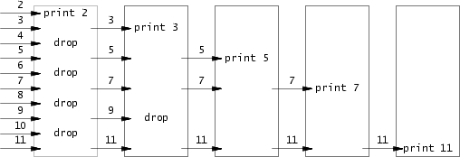

# util

## sleep

sleep实现比较简单。。。
```c
#include "kernel/types.h"
#include "kernel/stat.h"
#include "user/user.h"

int main(int argc, char *argv[]) {
    if (argc != 2) {
        fprintf(2, "Usage sleep: fail...\n");
        exit(1);
    }
    sleep(atoi(argv[1]));
    exit(0);
}
```

## pingpong

pingpong的实现主要是为了使得学生能够熟悉管道的使用。`pipe`。

每个进程都有三个标准输入输出，分别是

* 0--标准输入
* 1--标准输出
* 2--标准错误输出

pipe的参数是一个int型的数组，调用后将标准输出标定到int型数组中。p[0]表示输入，p[1]表示输出。

父进程执行fork后，子进程后继承父进程的系统资源，因此会拥有该管道，从而实现父子进程之间的通信。

```c
#include "kernel/types.h"
#include "kernel/stat.h"
#include "user/user.h"

int main(int argc, char *argv[]) {
    if (argc != 1) {
        fprintf(2, "Usage pingpong:fail...\n");
        exit(1);
    }
    int p2c[2], c2p[2];
    pipe(p2c), pipe(c2p);

    if (fork() == 0) {
        // 子进程到父进程
        char buf;
        read(p2c[0], &buf, sizeof(char));
        close(p2c[0]);

        printf("%d: received ping\n", getpid());
        write(c2p[1], "!", sizeof(char));
        close(c2p[1]);
    } else {
        // 父进程到子进程
        write(p2c[1], "!", sizeof(char));
        close(p2c[1]);

        char buf;
        read(c2p[0], &buf, sizeof(char));
        close(c2p[0]);
        printf("%d: received pong\n", getpid());
    }
    exit(0);
}
```

## primes

primes的实现如图所示。


在父进程中将2-35写入管道，此时该管道不会再写入任何数据，因此可以及时关闭（`close`）。

子进程的处理如下，如果能够从lp管道中读出数据num，此时表示num一定是一个素数，然后依次读出剩余数据n，如果$n\%num==0$，表示n不是一个素数，将其舍弃。否则将其写入下一个管道p。读出全部数据之后，`close(lp[1]),close(p[0])`。然后将p交给下一个子进程进行处理。

```c
#include "kernel/types.h"
#include "kernel/stat.h"
#include "user/user.h"

void primes(int lp[2]) {
    int num;
    if (read(lp[0], &num, sizeof(int)) == sizeof(int)) {
        fprintf(1, "prime %d\n", num);

        int p[2];
        pipe(p);

        int n;
        while (read(lp[0], &n, sizeof(int)) == sizeof(int))
            if (n % num)
                write(p[1], &n, sizeof(int));
        close(lp[0]);
        close(p[1]);

        if (fork() == 0) {
            primes(p);
        } else {
            wait(0);
        }
    } else
        close(lp[0]);
}

int main(int argc, char *argv[]) {
    if (argc != 1) {
        fprintf(2, "Usage primes:fail...\n");
        exit(1);
    }

    int p[2];
    pipe(p);
    for (int i = 2; i <= 35; i++)
        write(p[1], &i, sizeof(int));
    close(p[1]);

    if (fork() == 0) {
        primes(p);
    } else {
        wait(0);
    }
    exit(0);
}
```

## find

find要求实现在文件中查找。

主要实现open，stat操作。具体可参考[ls.c](../user/ls.c)的实现。

当通过路径获取到文件描述符后，可通过 fstat 获取文件的状态 stat。该结构记录了文件类型、链接数、大小等信息，如下：

```c
struct stat {
  int dev;     // File system's disk device
  uint ino;    // Inode number
  short type;  // Type of file
  short nlink; // Number of links to file
  uint64 size; // Size of file in bytes
};
```

通过 st.type 来判断文件里类型，如果是 DEVICE 或是 FILE 则进行字符传比较，如果是 DIR 则进入递归就行，比较简单。

```c
#include "kernel/types.h"
#include "kernel/stat.h"
#include "user/user.h"
#include "kernel/fs.h"

void find(char path[], char filename[]) {
    char buf[512], *p;
    int fd;
    struct dirent de;
    struct stat st;

    if ((fd = open(path, 0)) < 0) {
        fprintf(2, "find: cannot open %s\n", path);
        return;
    }

    if (fstat(fd, &st) < 0) {
        fprintf(2, "find: cannot stat %s\n", path);
        close(fd);
        return;
    }

    if (st.type != T_DIR) return;

    if (strlen(path) + 1 + DIRSIZ + 1 > sizeof buf) {
        printf("find: path too long\n");
        close(fd);
        return;
    }

    strcpy(buf, path);
    p = buf + strlen(buf);
    *p++ = '/';

    while (read(fd, &de, sizeof(de)) == sizeof(de)) {
        if (de.inum == 0)
            continue;
        if (!strcmp(de.name, ".") || !strcmp(de.name, "..")) continue;

        memmove(p, de.name, DIRSIZ);
        p[DIRSIZ] = 0;

        if (!strcmp(de.name, filename)) {
            printf("%s\n", buf);
        }
        if (stat(buf, &st) < 0) {
            printf("find: cannot stat %s\n", buf);
            continue;
        }
        if (st.type == T_DIR) find(buf, filename);
    }
    close(fd);
}

int main(int argc, char *argv[]) {
    if (argc != 3) {
        fprintf(2, "Usage find: fail...\n");
        exit(1);
    }
    find(argv[1], argv[2]);
    exit(0);
}
```

## xargs

xargs的实现看似比较困难，但实验要求我们实现一个简略版的xargs，还是比较容易的。至于xargs的用法可参考[xargs 命令教程](https://www.ruanyifeng.com/blog/2019/08/xargs-tutorial.html)

首先要了解`exec`的参数内容，第一个参数是命令，第二个参数是命令所带的参数。

因此我们需要将标准输入读取的字符流，将其恢复成命令拼接的参数的形式。

因此我们要使用一个二维char型数组表示参数。

首先将命令行中的参数保存进xargv中。然后用xargv[i][j]表示要保存的字符应该处于的位置。

从标准输入读如字符，只有一下三种情况

* '\n' 此时执行（exec）已有的命令，然后将状态恢复至最初--即仅有初始化时的参数。i=xargc，j=0
* '\ ' 此时完成一个参数，则将指针指向下一个新参数的开始。i++，j=0
* 其他字符 仅需拼接在上一个字符的后面，表示这个参数还没有结束。j++


```c
#include "kernel/types.h"
#include "kernel/stat.h"
#include "user/user.h"

#define MAGSIZE 16

int main(int argc, char *argv[]) {
    char *xargv[MAGSIZE] = {0};
    int xargc = 0;

    for (int i = 1; i < argc; i++) {
        xargv[xargc] = argv[i];
        xargc++;
    }

    int i = xargc, j = 0;

    char buf = 0;
    while (read(0, &buf, sizeof(char)) == sizeof(char)) {
        if (buf == ' ') {
            xargv[i][j] = '\0';
            if(xargv[i+1]==0)
                xargv[i + 1] = malloc(MAGSIZE * sizeof(char));
            i++;
            j = 0;
        } else if (buf == '\n') {
            xargv[i][j] = '\0';
            xargv[i + 1] = '\0';

            if (fork() == 0) {
                exec(xargv[0], xargv);
            }

            i = xargc;
            j = 0;

        } else {
            if (xargv[i] == 0)
                xargv[i] = malloc(MAGSIZE * sizeof(char));
            xargv[i][j] = buf;
            j++;
        }
    }

    wait(0);
    exit(0);
}
```